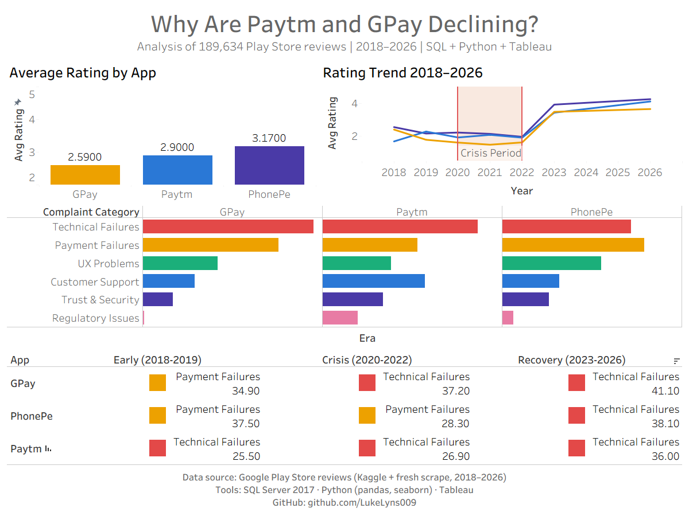

# UPI Playstore Analysis
### Why Are Paytm and GPay Declining in User Satisfaction?

**Author:** Shakti Kumar Sahoo  
**GitHub:** [LukeLyns009](https://github.com/LukeLyns009)  
**Tools:** SQL Server 2017 · Python · Tableau  
**Data:** 189,634 Google Play Store reviews · 2018–2026

---

## Project Overview

This is an end-to-end data analysis project investigating why Paytm and GPay are losing user satisfaction compared to PhonePe. The project analyses 189,634 Play Store reviews spanning 8 years (2018–2026) across three UPI payment apps which are Paytm, GPay, and PhonePe.

The analysis answers one business question:

> **"What are the specific reasons behind the declining user ratings of Paytm and GPay on the Google Play Store?"**

---

## Key Findings

| Finding | Detail |
|---|---|
| GPay has the worst ratings | 56.9% of GPay reviews are 1-2 stars - the worst of the three apps |
| All apps bottomed in 2020-2022 | The crisis period saw ratings drop to 1.48-2.08 across all apps |
| Paytm has 20x more regulatory complaints | 4.1% regulatory issues vs GPay's 0.2% - RBI action visible in data |
| Paytm collapsed in 2023 | Negative reviews spiked 1,249% from January to June 2023 |
| Paytm responds the most | 75.9% response rate vs GPay's 39.8% - but couldn't fix structural issues |
| Technical Failures persists | #1 specific complaint across all apps across all 8 years - never resolved |
| PhonePe recovered best | Fixed payment failures over time - now the strongest performer at 4.25★ |

---

## Pipeline Architecture

```
Raw Data Collection
├── Google Play Store scraper (Python - collect_playstore_reviews.py)
├── Kaggle dataset (6 CSV files, 240,000 raw reviews, 2018-2023)
└── News articles (Google News RSS - collect_news.py)
        ↓
Data Cleaning — Notebook 01
├── Bronze  → Raw CSVs loaded and tagged
├── Silver  → Cleaned, renamed, deduplicated
└── Gold    → 189,634 row master table, validated
        ↓
SQL Server — UPI_Analysis database
└── dbo.reviews — Gold master table (BULK INSERT from CSV)
        ↓
SQL Analysis — 6 independent T-SQL query files
├── Q1: Ratings Overview
├── Q2: Year by Year Trend (LAG window function)
├── Q3: Complaint Categories (CASE WHEN keyword classification)
├── Q4: Paytm Monthly Deep Dive (running totals, SUM OVER)
├── Q5: Company Response Analysis (DATEDIFF, AVG split by reply)
└── Q6: Era Comparison (CTEs, RANK, era bucketing)
        ↓
Python Visualisation — Notebook 03
├── 7 seaborn/matplotlib charts
└── 7 Tableau-ready CSV exports
        ↓
Tableau Dashboard
└── 4 sheets combined into one portfolio dashboard
```

---

## Repository Structure

```
upi-playstore-analysis/
│
├── README.md
│
├── notebooks/
│   ├── 01_data_cleaning.ipynb       ← Bronze → Silver → Gold pipeline
│   ├── 02_sql_runner.ipynb          ← Runs SQL files, saves results as CSVs
│   └── 03_visualisation.ipynb       ← Seaborn charts + Tableau exports
│
├── sql/
│   ├── query1_ratings_overview.sql
│   ├── query2_ratings_trend_by_year.sql
│   ├── query3_complaint_categories.sql
│   ├── query4_paytm_decline_deepdive.sql
│   ├── query5_company_response_analysis.sql
│   └── query6_era_comparison.sql
│
└── scripts/
    ├── collect_playstore_reviews.py  ← Google Play Store scraper
    └── collect_news.py               ← Google News RSS scraper
```

---

## Data Sources

This project uses publicly available data. Raw CSV files are not included in this repository due to size. To reproduce this project:

**1. Kaggle dataset (2018-2023 historical reviews)**  
Download from: [Google Play Reviews of UPI Apps](https://www.kaggle.com/datasets/hridyanshjain/googleplayreviewsofupiapps)

Files needed:
```
gpay_help.csv
gpay_new.csv
paytm_help.csv
paytm_new.csv
phonepe_help.csv
phonepe_new.csv
```

**2. Fresh scrape (2024-2026)**  
Run the included scraper:
```bash
pip install google-play-scraper pandas
python scripts/collect_playstore_reviews.py
```

**3. News articles**  
Run the included news scraper:
```bash
pip install requests pandas
python scripts/collect_news.py
```

---

## How to Reproduce

### Prerequisites

```
Python        3.10+
SQL Server    2017 or later (with SSMS)
ODBC Driver   17 for SQL Server
Tableau       Desktop (any version)
```

### Python dependencies

```bash
pip install pandas numpy matplotlib seaborn pyodbc google-play-scraper requests nbformat
```

### Step by step

**Step 1 - Collect data**
```bash
python scripts/collect_playstore_reviews.py
python scripts/collect_news.py
```
Download the Kaggle dataset and place all CSVs in the same folder as the notebooks.

**Step 2 - Clean data**

Open and run `notebooks/01_data_cleaning.ipynb` top to bottom.

This will:
- Load all raw CSV files
- Clean, deduplicate, and standardise the data
- Export `gold_master_export.csv`
- Print the SSMS setup T-SQL script (Step 11 output)

**Step 3 - Set up SQL Server**

Copy the T-SQL script printed by Notebook 01 Step 11 and run it in SSMS. This will:
- Create the `UPI_Analysis` database
- Create `dbo.reviews` table
- Import `gold_master_export.csv` via BULK INSERT
- Verify the import with a summary query

Update the file path in the BULK INSERT statement to match your machine.

**Step 4 - Run SQL analysis**

Open and run `notebooks/02_sql_runner.ipynb` top to bottom.

This connects to SQL Server, runs all 6 `.sql` files, and saves 9 result CSVs to `sql_results/`.

Connection string uses Windows Authentication:
```python
SERVER   = r'localhost\SQLEXPRESS'
DATABASE = 'UPI_Analysis'
```
Update `SERVER` if your instance name is different.

**Step 5 - Visualise**

Open and run `notebooks/03_visualisation.ipynb` top to bottom.

This produces:
- 7 PNG charts saved to `charts/`
- 7 Tableau-ready CSVs saved to `tableau_exports/`

**Step 6 - Tableau dashboard**

Open Tableau → Connect → Text File → select any file from `tableau_exports/`.

Build 4 sheets (Overview, Trend, Complaint, Summary) and combine into one dashboard.

---

## SQL Query Design

Each `.sql` file is fully self-documented with:
- Business question it answers
- Tables and columns used
- SQL operations explained
- Sampling bias notes where relevant
- Expected output description

All queries are written in **T-SQL (SQL Server 2017)** syntax using:
- Common Table Expressions (CTEs)
- Window functions (`LAG`, `RANK`, `SUM OVER`)
- `CASE WHEN` keyword classification
- `DATEDIFF` for response time analysis
- Conditional aggregation (`AVG CASE WHEN`)

---

## Sampling Bias Note

The Kaggle dataset contains two file types per app:

- `_help` files - scraped sorted by **Most Helpful** on Play Store. Dominated by highly upvoted complaints. Average ratings 1.79-2.53.
- `_new` files - scraped sorted by **Newest**. More balanced distribution. Average ratings 3.87-4.26.

This means 2018-2022 data is complaint-heavy by sampling design. The massive rating jump visible in 2023 is partially explained by the `_new` files bringing more balanced reviews into the dataset - not purely real-world improvement. All SQL queries include a comment noting this where relevant.

---

## Dashboard Preview



The dashboard answers the project question in one view:

- **Top left:** Average rating comparison across 3 apps
- **Top right:** Year by year rating trend with crisis period highlighted
- **Middle:** Specific complaint breakdown per app
- **Bottom:** Executive summary — top complaint per app per era (2018-19 / 2020-22 / 2023-26)

---

## Author

**Shakti Kumar Sahoo**  
GitHub: [LukeLyns009](https://github.com/LukeLyns009)

---

*This project was built as a portfolio piece demonstrating end-to-end data analysis skills - data collection, SQL analysis, Python visualisation, and Tableau dashboarding.*
